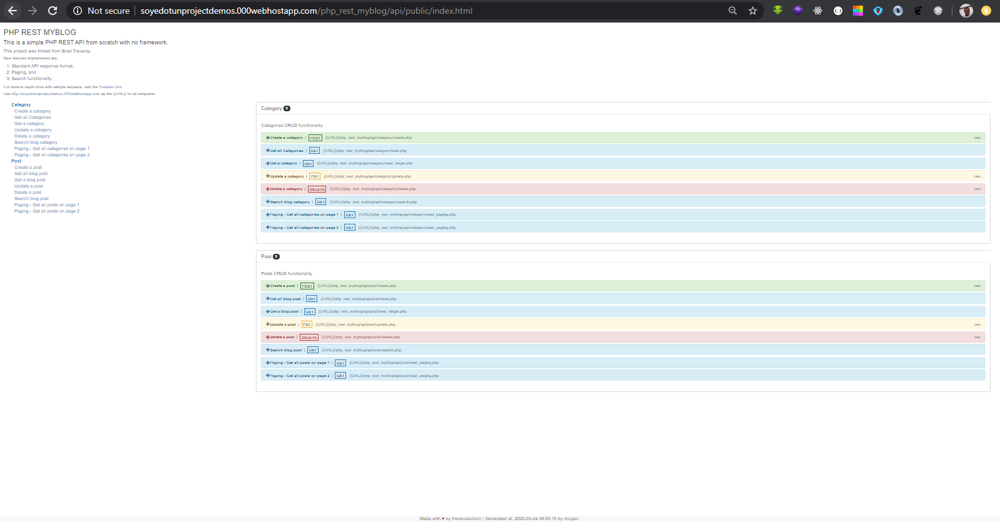

# PHP REST API

This is a simple PHP REST API from scratch with no framework.

# Quick Start

Import the myblog.sql file, change the params in the config/Database.php file to your own

### Testing

### Categories

#### Create a Category

* Method - POST

* URL - http://soyedotunprojectdemos.000webhostapp.com/php_rest_myblog/api/category/create.php

* Sample Request

```
{
    "name": "Job"
}
```

* Sample Response

```
{
    "status": true,
    "message": "Category Created"
}
```

#### Get all Categories

* Method - GET

* URL - http://soyedotunprojectdemos.000webhostapp.com/php_rest_myblog/api/category/read.php

* Sample Response

```
{
    "status": true,
    "message": "Categories Found",
    "data": [
        {
            "id": "7",
            "name": "Insurance"
        },
        {
            "id": "6",
            "name": "Department"
        },
        {
            "id": "1",
            "name": "Technology"
        },
        {
            "id": "2",
            "name": "Gaming"
        },
        {
            "id": "3",
            "name": "Auto"
        },
        {
            "id": "4",
            "name": "Entertainment"
        },
        {
            "id": "5",
            "name": "Books"
        }
    ]
}
```

#### Get a Category

* Method - GET

* URL - http://soyedotunprojectdemos.000webhostapp.com/php_rest_myblog/api/category/read_single.php?id=1

* Sample Response

```
{
    "status": true,
    "message": "Category Found",
    "data": {
        "id": "1",
        "name": "Technology"
    }
}
```

#### Update a Category

* Method - PUT

* URL - http://soyedotunprojectdemos.000webhostapp.com/php_rest_myblog/api/category/update.php

* HEADER

```
{
    "Key": "Content-Type",
    "Value": "application/json"
}
```

* Sample Request

```
{
    "id": "7",
    "name": "Insurtech"
}
```

* Sample Response

```
{
    "status": true,
    "message": "Category Updated"
}
```

#### Delete a Category

* Method - DELETE

* URL - http://soyedotunprojectdemos.000webhostapp.com/php_rest_myblog/api/category/delete.php

* HEADER

```
{
    "Key": "Content-Type",
    "Value": "application/json"
}
```

* Sample Request

```
{
    "id": "7"
}
```

* Sample Response

```
{
    "status": true,
    "message": "Category Deleted"
}
```

#### Search Blog Category

* Method - GET

* URL - http://soyedotunprojectdemos.000webhostapp.com/php_rest_myblog/api/category/search.php?s=tech

* Sample Response

```
{
    "status": true,
    "message": "Searched Category Found",
    "data": [
        {
            "id": "1",
            "name": "Technology"
        }
    ]
}
```

#### Get all Category - Paging

* Method - GET

* URL - http://soyedotunprojectdemos.000webhostapp.com/php_rest_myblog/api/category/read_paging.php

* Sample Request

```
{
    "status": true,
    "message": "Categories Paging",
    "data": [
        {
            "id": "6",
            "name": "Department"
        },
        {
            "id": "1",
            "name": "Technology"
        },
        {
            "id": "2",
            "name": "Gaming"
        },
        {
            "id": "3",
            "name": "Auto"
        },
        {
            "id": "4",
            "name": "Entertainment"
        }
    ]
}
```

#### View on Docgen

* URL - http://soyedotunprojectdemos.000webhostapp.com/lsecm/index.html
* LOCAL_URL - http://localhost/php_rest_myblog/api/public/index.html



### Author

Brad Traversy
[Traversy Media](http://www.traversymedia.com)

Sodiq Oyedotun
[Soyedotun Media](http://oyedotunsodiq.000webhostapp.com/)

### Version

1.0.0

### License

This project is licensed under the MIT License
